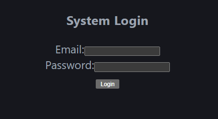
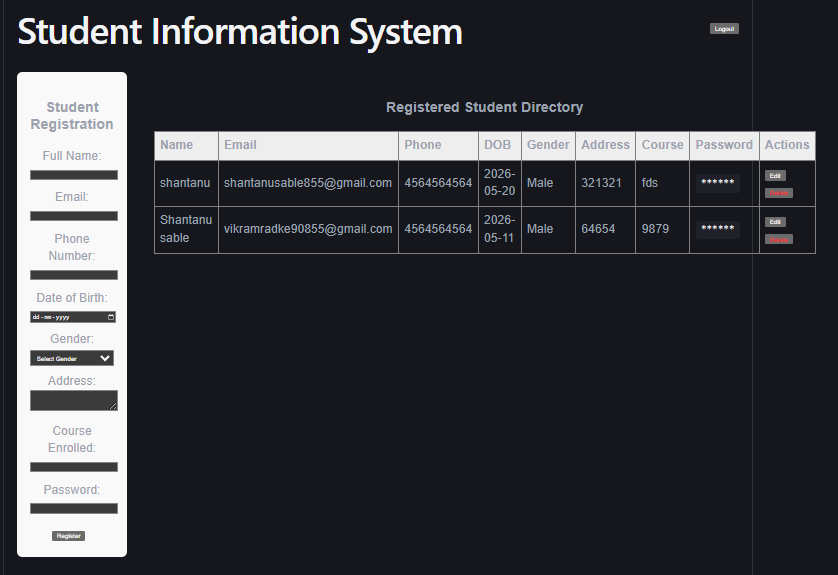

# Student Information System (with 2-Level Data Encryption)

A full-stack Student Registration and Management (CRUD) application built with React, Node.js, Express, TypeScript, and MongoDB. The project ensures high data security using a custom **2-Level AES Encryption** system before storing information in the database.

---

##  Tech Stack Used

*   **Frontend:** React (Vite), TypeScript, Axios, CSS3
*   **Backend:** Node.js, Express, TypeScript, `tsx` (Esm File Watcher)
*   **Database:** MongoDB Atlas (Cloud Instance), Mongoose ODM
*   **Security & Encryption:** `crypto-js` (Advanced Encryption Standard - AES)

---

## How Encryption is Implemented

To protect sensitive student fields (Password, Phone, Email, etc.), the application uses a strict **2-Level Cryptographic Pipeline** using `AES-256` encryption keys:

### 1. Level 1 (Client-Side Encryption)
*   When a user clicks "Register" or "Update", the frontend collects the 8 data fields into a JavaScript Object.
*   The object is serialized into a string and encrypted using a Client Secret Key (`frontend_level1_key`).
*   The raw human-readable data **never leaves the browser** over the network.

### 2. Level 2 (Server-Side Encryption)
*   The backend Express server receives the incoming payload (which is already encrypted at Level 1).
*   Without decrypting it, the server encrypts the entire cipher-text string **a second time** using a private Server Secret Key (`server_level2_key`).
*   This twice-encrypted text block is stored directly in MongoDB.

### 3. Decryption Flow (Data Retrieval)
*   **Database -> Server:** The backend reads the document, decrypts Level 2, and pushes the Level 1 string to the frontend over the API network.
*   **Server -> UI:** The React application receives the Level 1 string, decrypts it using its client-side key, parses the data object, and displays it in the data table.

---

##  Setup Instructions

Follow these steps to run both the frontend application and backend server locally on your machine.

### Prerequisites
*   Node.js (v18 or higher recommended)
*   npm package manager

### 1. Backend Server Setup
1. Open your terminal and navigate to the server folder:
   ```bash
   cd server
   ```
2. Install the production and development dependencies:
   ```bash
   npm install
   ```
3. Create a `.env` file inside the `server/` directory and add your MongoDB connection URI and encryption keys:
   ```env
   PORT=5000
   MONGO_URI=mongodb+srv://shantanuable856_db_user:<your_password>@cluster0.02s5ugf.mongodb.net/student_db?retryWrites=true&w=majority
   SERVER_SECRET_KEY=server_level2_key
   ```
4. Spin up the backend execution watch routine:
   ```bash
   npm run dev
   ```

### 2. Frontend Client Setup
1. Open a new terminal tab and navigate to the client folder:
   ```bash
   cd client
   ```
2. Install the necessary frontend node packages:
   ```bash
   npm install
   ```
3. Boot up the local client development engine interface:
   ```bash
   npm run dev
   ```
4. Hold `Ctrl` and click the link displayed in the terminal (usually `http://localhost:5173/`) to access the interface.

### 3. Default Login Credentials
To get past the system login gateway portal, use the static account details below:
*   **Email Address:** `admin@gmail.com`
*   **Password:** `admin`

---

## 📸 Application Screenshots

*( screenshots here when creating the repository documentation page)*

